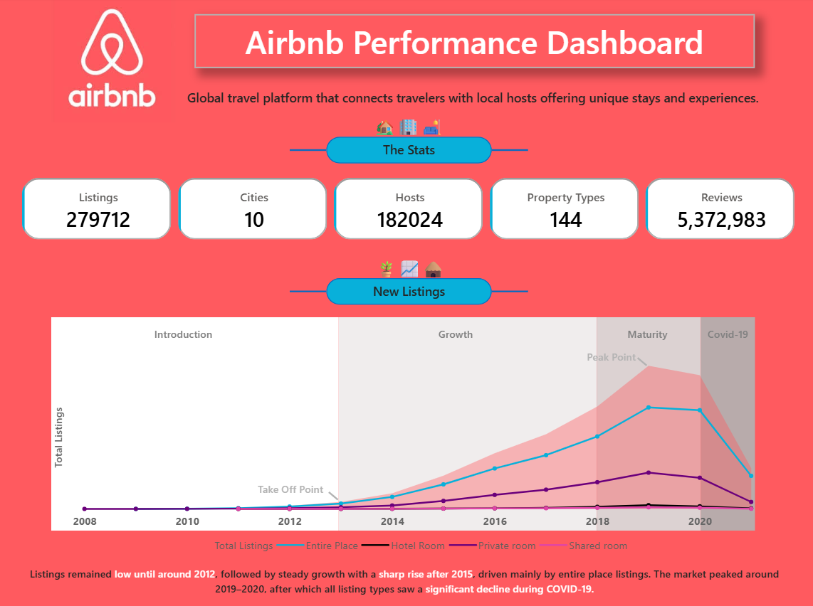
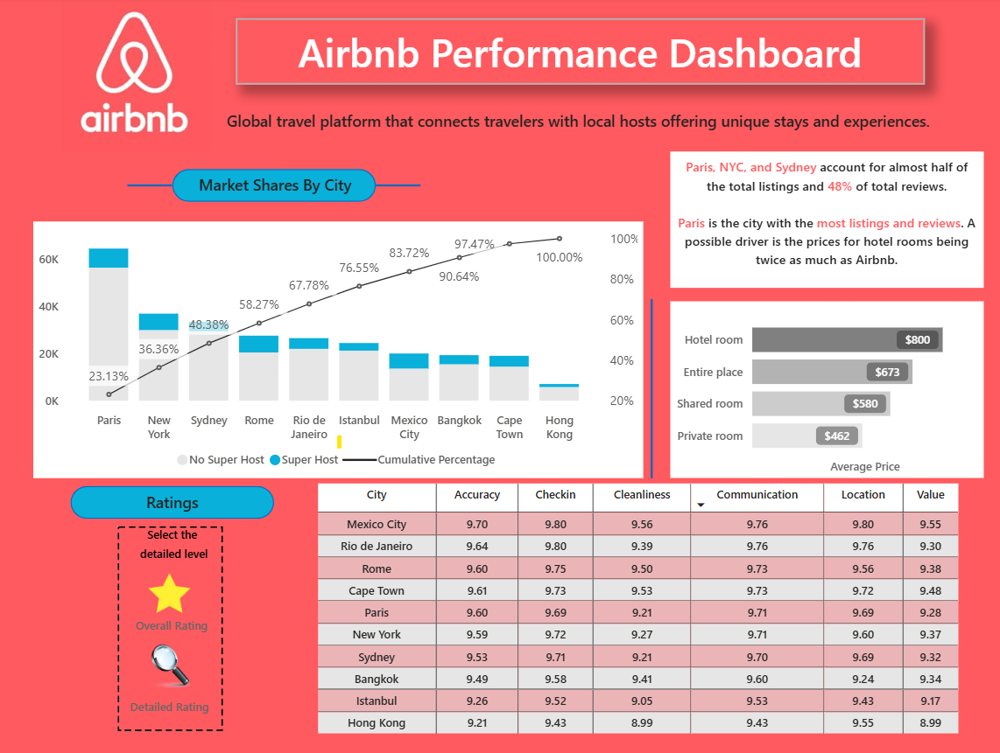

# 🏡 Airbnb Performance Dashboard - Power BI Project

## 📌 Overview
This project presents an interactive **Airbnb Performance Dashboard** built using Power BI.  
The dashboard analyzes Airbnb listing data to uncover insights related to listings, hosts, cities, reviews, and overall platform performance.

It also highlights **trends over time**, including the impact of external factors like **COVID-19 on Airbnb listings and growth**.

---

## 🎯 Objectives
- Analyze Airbnb listings across multiple cities
- Track key performance indicators (KPIs)
- Identify seasonal trends and peak periods
- Understand the impact of COVID-19 on listings
- Evaluate ratings and market distribution

---

## 📊 Dashboard Preview

### 🔹 Page 1: Listings & Trends Analysis

### 🔹 Page 2: Ratings & Market Share Analysis

---

## 🚀 Key KPIs
- 🏠 Total Listings  
- 🌆 Total Cities  
- 👤 Total Hosts  
- 🏡 Property Types  
- ⭐ Total Reviews  

---

## 📈 Key Features & Visuals

### 📅 Listings Trend Over Time
- Area/Line chart showing listing trends across months/years
- Identifies:
  - 📍 Takeoff point (growth phase)
  - 📍 Peak listing periods
  - 📍 Decline during COVID-19

### 🦠 COVID-19 Impact Analysis
- Visual representation of how Airbnb listings were affected during the pandemic
- Helps understand recovery trends post-COVID

### 🌍 Market Share by City
- Comparison of listing distribution across cities
- Identifies top-performing cities

### ⭐ Ratings Analysis
- Overview of customer ratings
- Helps evaluate customer satisfaction

### 📊 Additional Visuals Used
- Bar Chart  
- Clustered Bar Chart  
- Area Chart  
- KPI Cards  
- Interactive Filters  

---

## 🎛️ Advanced Features
- ✅ Bookmarks for interactive navigation
- ✅ Dynamic filtering and slicing
- ✅ Clean and user-friendly dashboard design

---

## 🛠️ Tools & Technologies
- Power BI  
- DAX (Data Analysis Expressions)  
- Excel / CSV Dataset  
